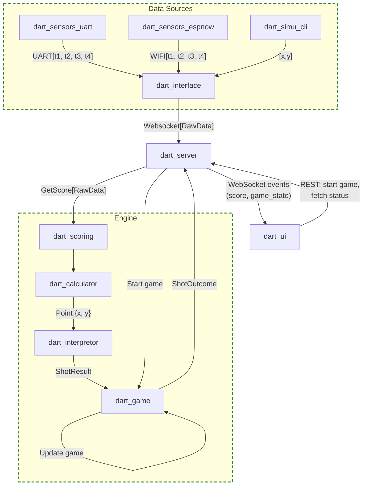

# Design

## Entities and interactions

### Dart interface

Its role is to make the bridge between the data sources (sensors and simulation) and the server. It abstracts away the details of how the data is retrieved and provides a unified interface for the server to receive either raw sensor timings or simulated coordinates.

- **dart_sensors_uart**: This is the row timing that have been retrieved from the sensors and are transmitted through the uart port
- **dart_sensors_espnow**: This is the row timing that have been retrieved from the sensors and are transmitted through the wifi (espnow protocol)
- **dart_simu_cli**: This is a command line tool that simulates dart throws by generating synthetic sensor timings based on specified coordinates (x, y) on the dartboard. It allows testing the localization and scoring algorithms without physical hardware.

### Dart server

The dart server is responsible for receiving data from the dart interface, processing it through the engine, and managing game state. It listens for WebSocket connections from the UI and broadcasts score updates and game state changes in real time.

## Dart engine

The dart engine is the core library that implements the physics and game logic. It consists of four modules that form a processing pipeline:

- **dart_scoring**: The orchestrator entry point. It exposes two functions:
- **dart_calculator**: The physics layer. It contains:
- **dart_interpretor**: The scoring layer. It converts a `Point {x, y}` into a score:
- **dart_game**: The game logic layer. It manages:
